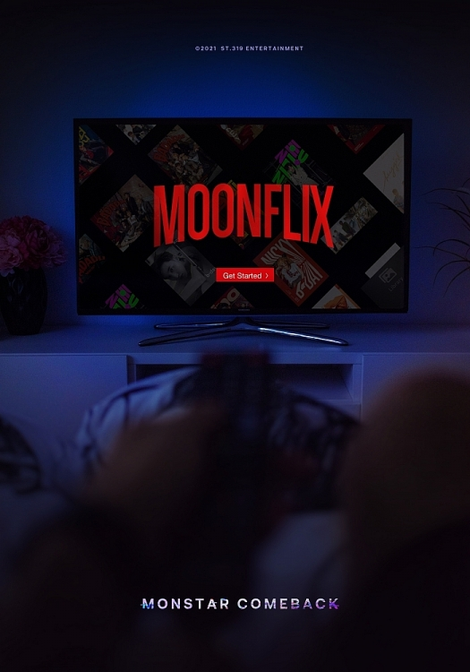

<h1 align="center" id="Title">
<a href="https://moonflixngc.netlify.app/" alt="MoonFlix">

MoonFlix
</a>
</h1>

<h2 id="Description">Project Description</h2>

This is a FullStack project made with MERN stack. MoonFlix is website where you will be able to see all of you favorites movies and TV series

<h2 id="Indice">Indice</h2>

- [Title](#Title)

- [Project Description](#Description)

- [Indice](#Indice)

- [Project status](#Status)

- [Project features](#Features)

- [Access to projects](#Acces)

- [Used technologies](#Technologies)

<h2 id="Status">Project Status</h2>

 ✅ FINISHED ✅

<h2 id="Status">Project Features</h2>

### Home Route

Here you can see the movies and TV series that are currently watched the most.

### Movies and Tv Series routes

Here you will find 2 categories of movies: "POPULAR" and "TOP RATED". You can choose what you want and watch all of the movies in each category.

### Search route

Here you will be able to search movies, TV series or actors. Choose what you desire.

### Favorites and Reviews routes

You can review and add to favorites the movies or TV series that you consider. In these two routes you can see a list of your reviews and favorites respectively.

### Password update routes

You need to sign up to MoonFlix with a username, display name and password. In this route you can change the latter, that is to say the password.

<h2 id="Acces">Access to projects</h2>

-  [**Open in browser**](https://moonflixngc.netlify.app/)

-  [**GitHub Repository**](https://github.com/NaimCBGhassan/Movies)

<h2 id="Technologies">Used technologies</h2>

### FrontEnd

<ul >
  <li>React</li>
  <li>JavaScipt</li>
  <li>TypeScipt</li>
  <li>MaterialUI</li>
  <li>React Router Dom</li>
  <li>Redux</li>
  <li>Redux Toolkit</li>
  <li>Redux Toolkit Query</li>
  <li>DayJS</li>
  <li>Formik</li>
  <li>Toastify</li>
  <li>Swiper</li>
  <li>Yup</li>

</ul>

### BackEnd

<ul >
  <li>NodeJs</li>
  <li>TypeScript</li>
  <li>ExpressJs</li>
  <li>Express Validator</li>
  <li>MongoDB</li>
  <li>Mongoose</li>
  <li>JSON Web Token</li>
  <li>Cors</li>
  <li>Dotenv</li>
  <li>Morgan</li>
</ul>
